# Kubernetes CMDS and Screenshot

### to check kubectl and kubernetes is installed or not
- kubectl version

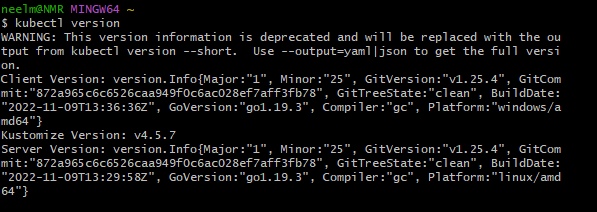

### to see the same thing in short version
- kubectl version --short (its human readable form)

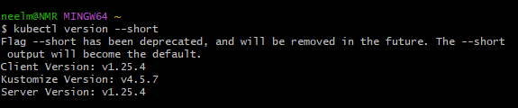

## Notes about PODS
- Pods is a layer of abstraction, that wraps around one or more containers, and all the containers shares the same ip address and same deployment mechanism
- unlike docker, we cnat create a container directly in kubernetes
- we can create pods, and pods hold one or more contianers

### run nginx
- kubectl run my-nignx --image nginx

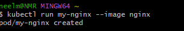

## ALL THE CMDS HERE ON

- kubectl get pods

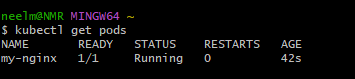

- kubectl get all

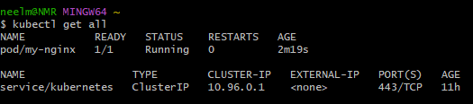

- kubectl crate deployment my-nginx --image nginx

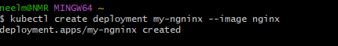

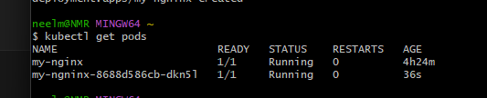

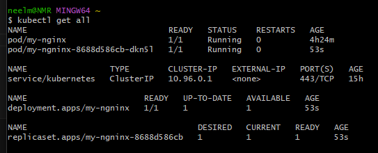

#### delete pods and deploymnet

- kubectl delete pod my-nginx

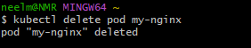

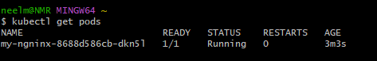

- kubectl delete deployment my-ngninx

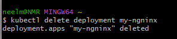

